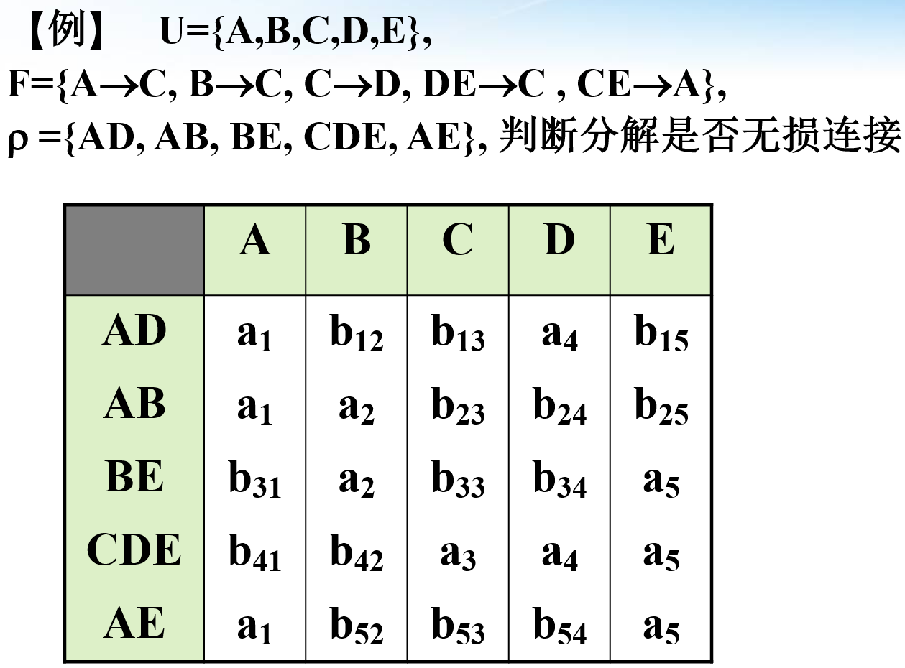

## 关系数据库

### 关系

- 属性：关系中的每一列
- 候选码：极小唯一确定元组的**属性组**
- 主码：候选码中的一个
- 主属性：所有候选码的并集；非码属性

### 关系操作

- 并、叉、笛卡尔积（、交）
- 选择（$\sigma$）、投影（$\Pi$）
- 连接：
  - $R \bowtie_{A\theta B} S=\sigma_{A\theta B}(R\times S)$
- 除：在 $R(X,Y)$ 中选择包含所有 $\Pi_Y S$ 的 $X$
  - $R(X,Y)\div S(Y,Z)=\Pi_X(R)-\Pi_X(\Pi_X(R)\times\Pi_Y(S)-R)$
  - $(R\div S)\times \Pi_Y(S)\subseteq R$

### 关系完整性

- 实体完整性：主属性非空
- 参照完整性：外码为空或对应某个元组的主码
- 用户定义的完整性

## 关系数据理论

### 函数依赖

- 函数依赖 $X\rightarrow Y$：$R(U)$ 中 $X,Y\subseteq U$，每个 $X$ 对应唯一的 $Y$

- 非平凡函数依赖：$X\rightarrow Y$ 且 $Y\not\subseteq X$

- 完全函数依赖 $X\overset{f}\rightarrow Y$：对于任意 $X$ 的子集 $X'$ 有 $X'\not\rightarrow Y$（极小的 $X$）

  部分函数依赖 $X\overset{p}\rightarrow Y$

- 传递函数依赖：$X\rightarrow Y\rightarrow Z$，$Y\not\rightarrow X$

- 候选码 $K$：$K\overset{f}\rightarrow U$

### Armstrong 公理系统

- 自反律：$Y\subseteq X\Rightarrow X\rightarrow Y$
- 增广律：$X\rightarrow Y\Rightarrow XZ\rightarrow YZ$
- 传递率：$X\rightarrow Y,\ Y\rightarrow Z\Rightarrow X\rightarrow Z$
- 合并/分解率：$X\rightarrow Y,\ X\rightarrow Z\Leftrightarrow X\rightarrow YZ$
- 伪传递率：$X\rightarrow Y,\ WY\rightarrow Z\Rightarrow WX\rightarrow Z$
- $X_F^+=\{x\mid X\rightarrow\{x\}\}$
  - $X\rightarrow Y\Leftrightarrow Y\subseteq X_F^+$
- 求候选码
  - 删除平凡函数依赖
  - 求 $N$：$U-\{y\mid X\rightarrow Y,y\in Y\}$
  - 求 $LR$：$\{x\mid X\rightarrow Y,x\in X\} \cap\{y\mid X\rightarrow Y,y\in Y\}$
  - 枚举 $S\subseteq LR$（$S$ 不包含其他候选码），$(N\cup S)^+=U\Rightarrow S$ 为候选码
- 求 $F$ 的极小依赖集 $F_m$
  - 分解右侧的多属性依赖
  - 去掉多余的函数依赖 $X\rightarrow Y$：$Y\subseteq X_{F-\{X\rightarrow Y\}}^+$
  - 去掉左部的多余属性 $X\rightarrow Y\Rightarrow (X-A)\rightarrow Y$：$Y\subseteq (X-A)_F^+$

### 范式

- 1NF：每个属性及其值不可再分

  - 展开嵌套属性

  - 重写行交叉处的值

- 2NF：不存在**非主属性**对码的**部分函数依赖**
  - eg：$\{A,B,C,D\}:AB\rightarrow C,\ A\rightarrow D$

- 3NF：不存在**非主属性**对码的**传递函数依赖**
  
  - 不允许 $X\rightarrow Y\rightarrow Z$，$Y$ 不含码且不包含 $Z$
  - eg：$\{A,B,C\}:A\rightarrow B,\ B\rightarrow C$
  
- BCNF：所有非平凡**函数依赖**左侧**包含候选码**

  - eg：$\{A,B,C\}:AB\rightarrow C,\ C\rightarrow A$

    （没有非主属性，但 $C$ 不是候选码）

- 4NF：所有非平凡**多值依赖**左侧**包含候选码**

  - 多值依赖 $X\rightarrow \rightarrow Y$：$Y$ 的值仅与 $X$ 有关，与 $Z=U-X-Y$ 无关

    - $(x,y_1,z_1),(x,y_2,z_2)\Rightarrow (x,y_1,z_2),(x,y_2,z_1)$

      $R(U)=R(X,Y)\bowtie R(X,Z)$

    - 非平凡多值依赖：$X\cup Y\neq U$

    - $X\rightarrow Y\Rightarrow X\rightarrow \rightarrow Y$

  - eg：$\{A,B,C\}:A\rightarrow \rightarrow B,A\rightarrow \rightarrow C$，候选码 $\{ABC\}$

    | A    | B    | C    |
    | ---- | ---- | ---- |
    | 1    | a    | c    |
    | 1    | a    | d    |
    | 1    | b    | c    |
    | 1    | b    | d    |

  - 等价：所以非平凡多值依赖都是函数依赖

- 结论
  - 二元关系：4NF
  - 全码：至少 BCNF
  - 全主属性：至少 3NF
  - 只有一个主属性：至少 2NF

### 关系模式的分解

- 分解：$ \rho=\{R_i\langle U_i,\Pi_{U_i}(F)\rangle\}\ (\cup_i U_i=U)$

  - 投影：$\Pi_U(F)=\{X\rightarrow Y\mid X\rightarrow Y\in F^+\and XY\subseteq U\}$

- 无损链接：$\rho$ 有无损链接性 $\Leftrightarrow r=m_\rho(r)$

  - $m_\rho(r)=\bowtie_i r_i$

  - 判断：

    

    $X\rightarrow Y$：若 $X$ 的列全为 $a$ 可以推出 $Y$ 的列也为 $a$

    存在某一行全为 $a$ 则为无损连接

  - $\rho=\{R_1\langle U_1,F_1\rangle,R_2\langle U_2,F_2\rangle\}$ 为无损链接

    $\Leftrightarrow (U_1\cap U_2\rightarrow U_1-U_2)\in F^+$ 或 $(U_1\cap U_2\rightarrow U_2-U_1)\in F^+$

- 分解算法

  - 求 $F$ 的最小覆盖，合并相同左部得到正则覆盖 $F_c$
  - 加入没被包含进去的候选码

