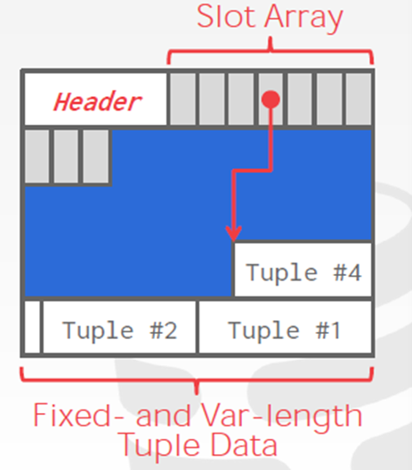

## 引擎基础

- 槽位映射到元组开始位置的偏移量
- Header
  - 已占用的槽位
  - 上一次使用槽位的开始位置
- Tuple：页内倒序存放
- 优点：方便存储变长数组，解决了碎片问题

## 关系查询处理和优化

### 代数优化

- 选择运算先做
- 投影选择同时进行
- 投影运算与双目运算结合起来
- 选择运算 + 笛卡尔积 → 连接运算：$\sigma_F(S\times T)=S\bowtie_F T$
- 提取公因子

### 物理优化

- 选择

  - 主码 = 值：主码索引

  - 非主码 = 值 或 非等值查询，有索引

    估计结果行数，少则用索引，多则扫描全表

  - 交：组合索引 或 部分索引并筛选扫描后的结果

  - 并：扫描全表

- 连接

  - 有序：直接合并

  - 有索引：索引连接算法

  - 其中一个表较小：Hash join

  - 选块数较少的表做外表

    外表 $R$ 有 $B_R$ 块，$S$ 有 $B_S$ 块，内存缓冲区块数 $k$：$B_R+B_S\Big\lceil\dfrac{B_R}{k-2}\Big\rceil$

